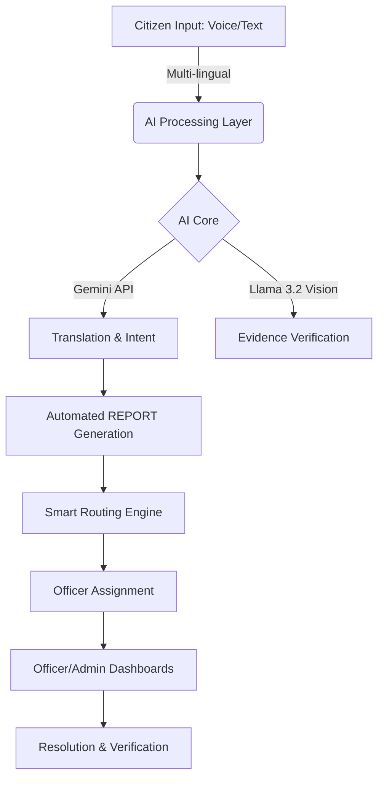
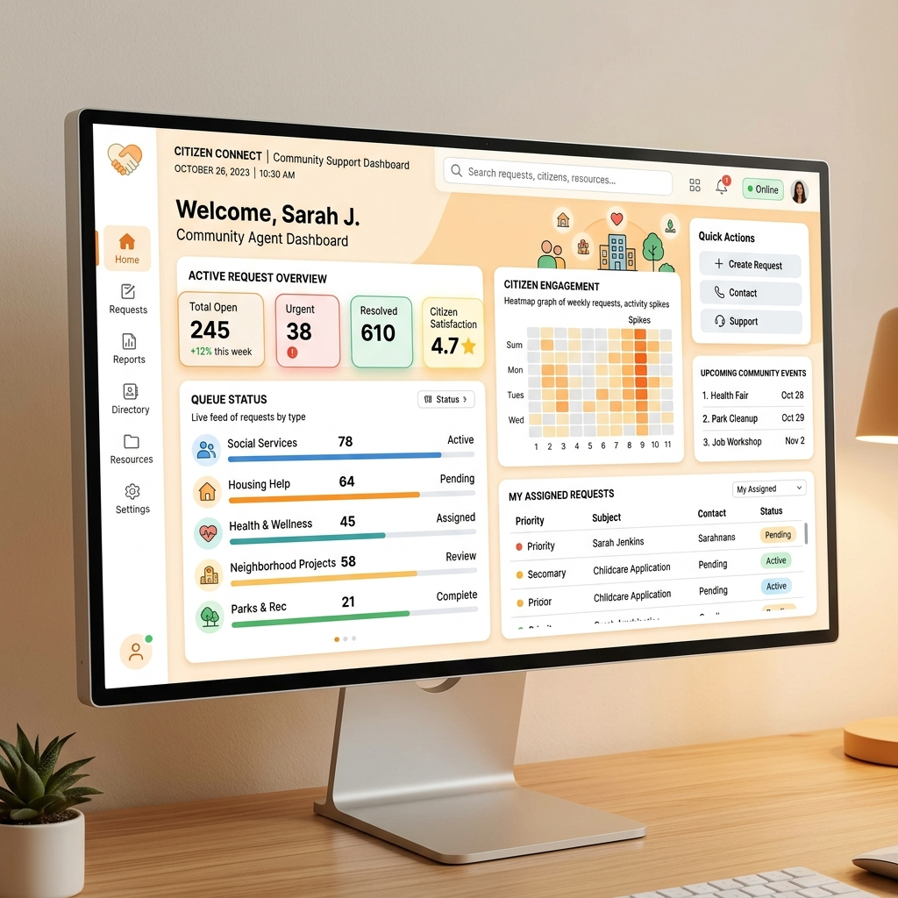
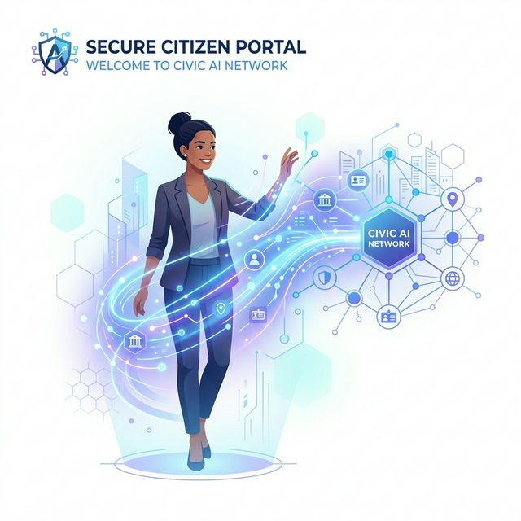

<div align="center">

# 🚔 Multilingual AI-powered Central Grievance Management Portal (CGMP)

<p><strong>Transforming citizen complaints into structured, actionable authority intelligence — instantly, accurately, and at scale.</strong></p>

<br/>

[](https://github.com/Abhinay-12-k/Multilingual-AI-Powered-Interactive-Complaint-Portal/stargazers)
[](LICENSE)
[](https://nodejs.org/)
[](https://reactjs.org/)
[](https://mongodb.com/)
[](https://ai.google.dev/)

<br/>

> _"This is not just a digital form. This is a cognitive infrastructure for modern governance."_


</div>

---

## 📌 Table of Contents

- [Overview](#-overview)
- [The Problem](#-the-problem)
- [The Solution](#-the-solution)
- [Key Features](#-key-features)
- [System Architecture](#-system-architecture)
- [Dashboard Previews](#-dashboard-previews)
- [Tech Stack](#-tech-stack)
- [Getting Started](#-getting-started)
- [Real-World Impact](#-real-world-impact)
- [Future Scope](#-future-scope)

---

## 🌐 Overview

The **Central Grievance Management Portal (CGMP)** is a production-grade, full-stack intelligent system designed to eliminate the friction between citizens and law enforcement. By leveraging state-of-the-art **Generative AI (Google Gemini)** and **Computer Vision (Llama 3.2 Vision)**, the portal automates the entire lifecycle of a complaint—from intake in regional languages to intelligent officer assignment and automated resolution verification.

---

## ❌ The Problem

Current policing and grievance portals suffer from critical systemic bottlenecks:

- 🏮 **Language Exclusivity**: Portals are often limited to English/Hindi, alienating 60% of regional speakers.
- 📉 **Manual Intake**: Officers spend 40% of their time manually sorting and documenting unstructured complaints.
- ⌛ **Deadlocks**: Critical life-safety issues get buried under routine administrative complaints without smart prioritization.
- 🏚️ **Verification Gaps**: False reports waste authority resources; resolved cases lack objective proof of work.
- 🗺️ **Data Silos**: No way to visualize crime patterns or geospatial clusters in real-time.

---

## ✅ The Solution: AI-First Governance

CGMP replaces manual workflows with an **Intelligence Pipeline**:

1. **Intake**: Multi-lingual text or voice input.
2. **Translation**: Real-time high-fidelity translation to English.
3. **Analysis**: AI-driven categorization, priority detection, and sentiment analysis.
4. **Drafting**: Automated generation of structured REPORT drafts.
5. **Logic**: Smart load-balanced assignment to the right department and officer.
6. **Vision**: AI-powered verification of evidence and resolution proof.

---

## ⚡ Key Features

### 🌍 Multilingual NLP Engine
- **Voice & Text Support**: Submit complaints in any Indian regional language (Hindi, Telugu, Tamil, etc.).
- **Auto-Detection**: Zero-hassle intake; the system intelligently identifies the source language.
- **High-Fidelity Translation**: Preserves original context while providing standardized English reports for officials.

### 🤖 AI-Powered Intelligence
- **Automated Categorization**: Gemini AI identifies crime types (Theft, Cybercrime, Assault, etc.).
- **Priority Detection**: Categorizes urgency from `Low` to `Critical` based on content analysis.
- **REPORT Draft Generation**: Submits a professional, structured REPORT draft immediately upon intake.
- **AI Case Assistant**: A context-aware chatbot for officers to query the entire case database using natural language.

### 👁️ AI Vision Verification (New)
- **Evidence Analysis**: Uses **Computer Vision (Llama 3.2)** to verify if uploaded evidence matches the reported category.
- **Resolution Proof**: Officers must upload proof of work (e.g., cleared garbage, fixed infrastructure), which the AI verifies before closing the case.

### 🗺️ Geospatial Intelligence
- **Complaint Heatmaps**: Every report is geotagged upon submission.
- **Interactive Maps**: Admins view complaint clusters via **Leaflet.js** to identify crime hotspots.

### 🛡️ Enterprise-Grade Dashboards
- **Admin Command Center**: Holistic view of department performance, role management, and system KPIs.
- **Officer Workspace**: Actionable queue of assigned cases with one-click status updates and audit logs.
- **Citizen Portal**: Real-time status tracking, feedback loops, and secure profile management.

---

## 🏗️ System Architecture



---

## 📸 Dashboard Previews

<table width="100%">
  <tr>
    <td width="50%">
      <br/>
      <sub><b>AI Reporting Interface</b>: Adaptive input with voice support.</sub>
    </td>
    <td width="50%">
      <br/>
      <sub><b>Officer Dashboard</b>: Prioritized case management and AI assistance.</sub>
    </td>
  </tr>
  <tr>
    <td width="50%">
      <br/>
      <sub><b>Network Overview</b>: Visualizing connections and status history.</sub>
    </td>
    <td width="50%">
      <br/>
      <sub><b>Secure Authentication</b>: JWT-based RBAC for all user roles.</sub>
    </td>
  </tr>
</table>

---

## 🛠️ Tech Stack

- **Frontend**: `React 18`, `Vite`, `CSS3 (Vanilla)`, `Leaflet.js`
- **Backend**: `Node.js`, `Express.js`, `Morgan`, `JWT`
- **Database**: `MongoDB Atlas`, `Mongoose`
- **AI Models**: `Google Gemini 1.5 Pro` (Text/Analayis), `Llama 3.2 Vision` (Computer Vision)
- **Infrastructure**: `Multer` (File Handling), `Axios`, `dotenv`, `BcryptJS`

---

## 🚀 Getting Started

### 1. Clone & Install
```bash
git clone https://github.com/Abhinay-12-k/Multilingual-AI-Powered-Interactive-Complaint-Portal.git
cd Multilingual-AI-Powered-Interactive-Complaint-Portal/CGMP
```

### 2. Configure Environment
Create a `.env` in the `backend/` directory:
```env
PORT=5001
MONGO_URI=your_mongodb_uri
JWT_SECRET=your_jwt_secret
GEMINI_API_KEY=your_gemini_key
GROQ_API_KEY=your_groq_vision_key
```

### 3. Run Development Servers
```bash
# Terminal 1: Backend
cd backend && npm install && npm run dev

# Terminal 2: Frontend
cd frontend && npm install && npm run dev
```

---

## 🌍 Real-World Impact

| metric | Impact |
|---|---|
| **Response Time** | Reduced from **days to minutes** via auto-routing. |
| **Accessibility** | **100% inclusion** for regional language speakers. |
| **Integrity** | AI-verified resolution proof eliminates "paper-only" fixes. |
| **Authority Workload** | Automated documentation saves **~15 hours/week per officer**. |

---

## 👨‍💻 Author

Built by **[Abhinay](https://github.com/Abhinay-12-k)** — *Modernizing public safety infrastructure through code.*

---

<div align="center">

**Is this project valuable? Give it a ⭐ — every star fuels innovation.**

[](https://github.com/Abhinay-12-k/Multilingual-AI-Powered-Interactive-Complaint-Portal)

</div>
